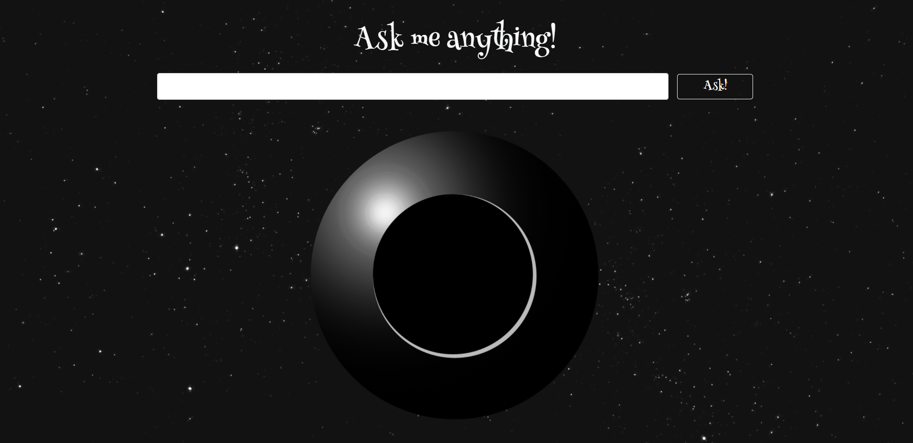

# magic8ball

The magic 8 ball knows all. It peers into the future to find answers to the buring questions on your mind. Simply ask the magic 8 ball a question that can be asnwered with a "Yes" or "No", concentrate very hard on the question, and click the "Ask" button. Then wait while the all knowing 8 ball looks into the future to uncover the answer.

## Description
This project was built as my final project for [Geekwise Academy's](https://geekwiseacademy.com/) Javascript for Beginners course. The project was build using modern, modular, ES6 JavaScript. The application is written entirely in vanilla JavaScript, but was heavily inspired by trying to imitate the React libary - in particular, tyring to immitate JSX.